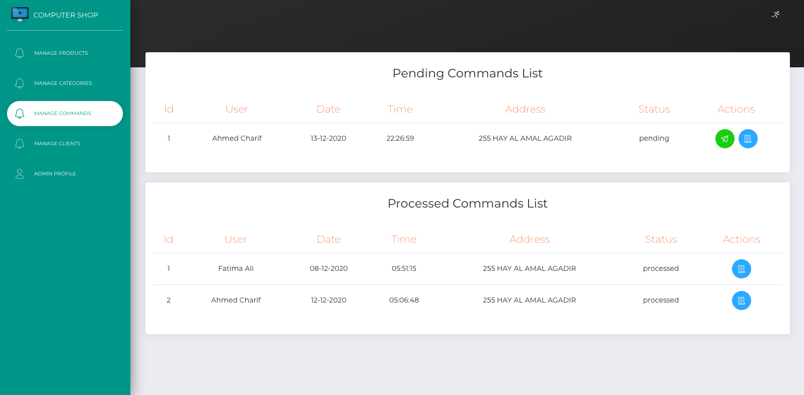

# Computer Shop
> A web application of a computer shop built with Angular and SparkJava


## Description
This project is a web application of a computer shop, it has two users, the shop administrator and the client.
The admin can manage categories, products, commands and clients' accounts, the client can add items to his cart then check out and follow his commands.

## Built With
* [Gson](https://github.com/google/gson)
* [sparkjava](https://github.com/perwendel/spark)
* [MySQL](https://www.mysql.com)
* [Angular](https://angular.io)
* [Node.js](https://nodejs.org/en)
* [Java-jwt](https://github.com/auth0/java-jwt)

## Features
+ The administrator :
* [x] Manage categories
* [x] Manages products (computers)
* [x] Manage commands
* [x] Manage users
+ The client :
* [x] Authentication
* [x] Add items to the cart
* [x] Make commands

## Screenshots

>Sign in :


>Sign up :


>Manages products :


>View product photo :


>Manage categories :


>Manage commands :


>Manage clients :


>Edit personal information :


>Log out :


>Products list (for the client) :


>View the cart :


>Checkout :


>View command items


## How To Run
+ Install Intellij IDEA IDE : https://www.jetbrains.com/idea
### Run the Back-End app :
+ Install JDK 8
```bash
# On Windows :
choco install openjdk
# On Ubuntu :
sudo apt install openjdk-8-jdk
# On MAC OS :
brew tap adoptopenjdk/openjdk
brew cask install adoptopenjdk8
```

+ Install MySQL Server
```shell
# On Windows :
choco install mysql
# On MAC OS :
brew install mysql
# On Ubuntu :
sudo apt-get install mysql-server
```

+ Create database tables, with the queries located in the file database.sql :
```sql
CREATE DATABASE ComputerShop;
USE ComputerShop;

DROP TABLE IF EXISTS Users;
CREATE TABLE Users
(
    Id        INTEGER PRIMARY KEY NOT NULL AUTO_INCREMENT,
    FirstName VARCHAR(280)        NOT NULL,
    LastName  VARCHAR(280)        NOT NULL,
    Email     VARCHAR(280)        NOT NULL UNIQUE,
    Type      VARCHAR(280)        NOT NULL,
    Password  VARCHAR(280)        NOT NULL,
    Verified  INTEGER             NOT NULL DEFAULT 0
);

DROP TABLE IF EXISTS Categories;
CREATE TABLE Categories
(
    Id   INTEGER PRIMARY KEY NOT NULL AUTO_INCREMENT,
    Name VARCHAR(280)        NOT NULL UNIQUE
);

DROP TABLE IF EXISTS Products;
CREATE TABLE Products
(
    Id          INTEGER PRIMARY KEY NOT NULL AUTO_INCREMENT,
    Name        VARCHAR(280)        NOT NULL,
    Description VARCHAR(280)        NOT NULL,
    Photo       VARCHAR(280)        NOT NULL,
    Category    INTEGER             NOT NULL,
    Quantity    INTEGER             NOT NULL,
    Price       FLOAT               NOT NULL
);

DROP TABLE IF EXISTS Carts;
CREATE TABLE Carts
(
    Id   INTEGER PRIMARY KEY NOT NULL AUTO_INCREMENT,
    User INTEGER             NOT NULL
);

DROP TABLE IF EXISTS Commands;
CREATE TABLE Commands
(
    Id      INTEGER PRIMARY KEY NOT NULL AUTO_INCREMENT,
    User    INTEGER             NOT NULL,
    Date    VARCHAR(280)        NOT NULL,
    Time    VARCHAR(280)        NOT NULL,
    Address VARCHAR(280)        NOT NULL,
    Status  VARCHAR(280)        NOT NULL
);

DROP TABLE IF EXISTS CommandItems;
CREATE TABLE CommandItems
(
    Id       INTEGER PRIMARY KEY NOT NULL AUTO_INCREMENT,
    Item     INTEGER             NOT NULL,
    Quantity INTEGER             NOT NULL,
    Command  INTEGER             NOT NULL
);

DROP TABLE IF EXISTS CartItems;
CREATE TABLE CartItems
(
    Id       INTEGER PRIMARY KEY NOT NULL AUTO_INCREMENT,
    Item     INTEGER             NOT NULL,
    Quantity INTEGER             NOT NULL,
    Cart     INTEGER             NOT NULL
);

INSERT INTO Users (Id, FirstName, LastName, Email, Type, Password, Verified)
VALUES (1, 'Computer', 'Shop', 'admin@gmail.com', 'admin', '21232f297a57a5a743894a0e4a801fc3', 1);
```

+ Edit the file Settings.java :
```java
package com.computer.shop.settings;

public class Settings {
    public static String email = "computer.shop.2021@gmail.com";
    public static String emailPassword = "dIgit}alizaTion#{[@]&519";
    public static String databaseHost = "localhost";
    public static String databasePort = "3306";
    public static String databaseUser = "root";
    //TODO: Put your MySQL server password here :
    public static String databasePassword = "";
    public static String databaseName = "ComputerShop";
}
```
+ Run the Back-End application (Application.java).
### Run the Front-End app :
+ Install nodejs
```shell
# On Windows :
choco install nodejs
# On MAC OS :
brew install node
# On Ubuntu :
sudo apt-get install nodejs
```
+ Install the packages :
```shell
npm install
```
+ Start the Front-End application :
```shell
npm start
```
+ Open http://localhost:4200 in the browser
  
+ To log in as an admin use the email : **admin@gmail.com** and the password : **admin**

## Contributing

Pull requests are welcome. For major changes, please open an issue first to discuss what you would like to change.

## License
[MIT License](https://choosealicense.com/licenses/mit/)


## Contact
- Imane Thabit - thabiteimane@gmail.com

